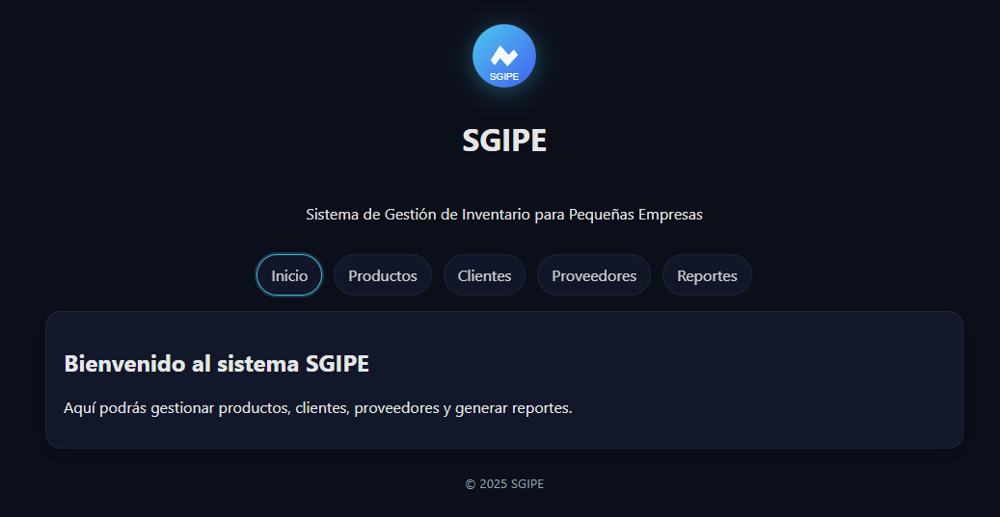
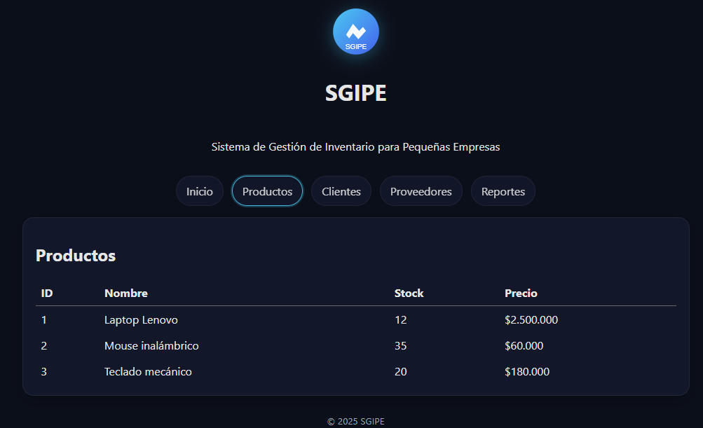
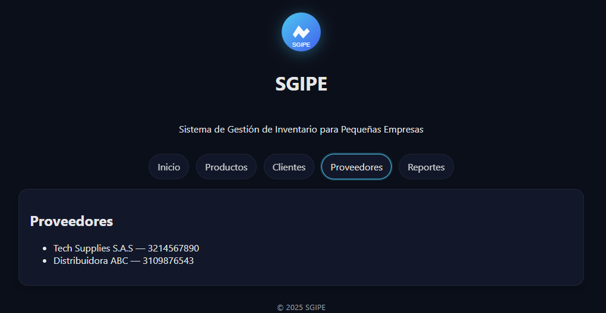
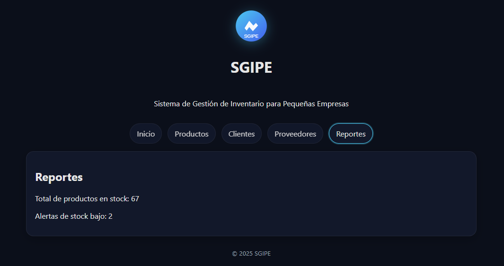

# SGIPE — Sistema de Gestión de Inventario para Pequeñas Empresas

Este proyecto corresponde a la evidencia **GA7-220501096-AA4-EV03**, desarrollado con **React + Vite** como frontend.

---

## 📝 Explicación del proyecto

El **Sistema de Gestión de Inventario para Pequeñas Empresas (SGIPE)** es una aplicación web diseñada para facilitar la administración de recursos en negocios de tamaño pequeño o mediano.  

El objetivo principal es ofrecer una herramienta **sencilla, intuitiva y práctica** que permita al usuario:

- Registrar y consultar productos disponibles en inventario.
- Mantener información básica de clientes y proveedores.
- Identificar de forma rápida alertas de stock bajo.
- Generar reportes simples para la toma de decisiones.

El sistema está construido sobre **React** como librería de frontend, con **Vite** como herramienta de desarrollo, lo que garantiza un entorno ligero y rápido para pruebas y despliegue.

En esta versión de la evidencia, los datos de cada módulo (productos, clientes, proveedores, reportes) son **ejemplos simulados**, con el fin de demostrar la funcionalidad del sistema y su interfaz gráfica, siguiendo el mismo enfoque utilizado en proyectos anteriores como el de Tatiana.

---

## 🚀 Instalación y ejecución

1. Clonar o descargar el repositorio.  
2. Instalar dependencias:
   ```bash
   npm install

3. ejecutar el entorno de desarrollo:
npm run dev

4. abrir en el navegador la URL que indica Vite, normalmente:
http://localhost:5173/

5. Funcionalidades

Inicio: pantalla de bienvenida.

Productos: tabla con productos de ejemplo (ID, nombre, stock y precio).

Clientes: listado básico de clientes registrados.

Proveedores: listado de proveedores con sus datos de contacto.

Reportes: totales y alertas de stock simuladas.

6. capturas
## 📸 Capturas

### Inicio


### Productos


### Clientes


### Proveedores


### Reportes

